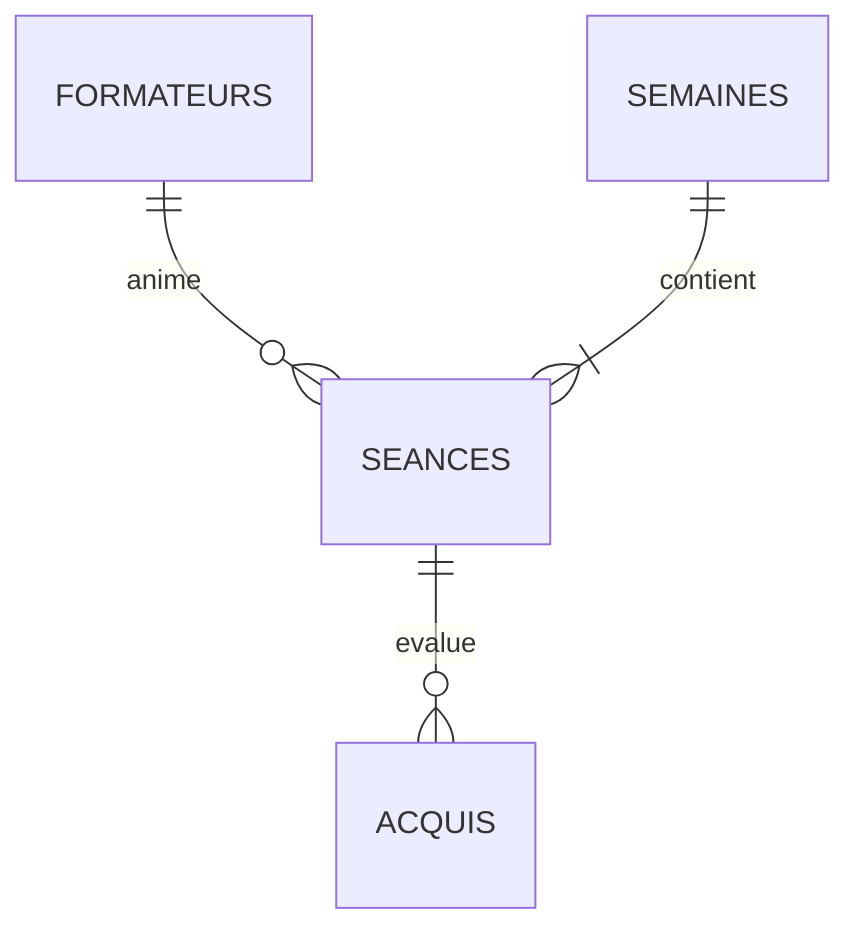

# B1 — Conception de la base

Base choisie : **PostgreSQL 17**.

## 1. Les tables



- **formateurs** : `id` (t1, t2…), `nom`.
- **semaines** : `debut` (le lundi de la semaine), `libelle`.
- **seances** : `id`, `date`, `periode`, `groupe`, `mode`, `titre`, `domaine`, `formateur_id`, `statut`, `duree_minutes`, `semaine_debut`.
- **acquis** : `id`, `seance_id`, `libelle`, `valide`, `valide_le`.

### Clés

| Table | Clé | Pourquoi |
|---|---|---|
| formateurs | `id` | c'est l'identifiant du sujet (t1, t2, t3) |
| semaines | `debut` | une semaine = son lundi, c'est simple et lisible |
| seances | `id` | c'est l'identifiant du sujet (s01…) |
| acquis | numéro automatique | il n'y a pas d'identifiant naturel |

**Liens entre tables (clés étrangères)**
- une séance pointe vers son formateur (ou vers rien si elle n'en a pas encore) ;
- une séance pointe vers sa semaine. La semaine est **calculée automatiquement à partir de la date**, ce qui évite les erreurs ;
- un acquis pointe vers sa séance. Si la séance est supprimée, ses acquis le sont aussi.

### Cardinalités

- Un formateur a **0 ou plusieurs** séances. Une séance a **0 ou 1** formateur.
- Une semaine a **1 ou plusieurs** séances. Une séance est dans **1 seule** semaine.
- Une séance a **0 ou plusieurs** acquis. Un acquis est lié à **1 seule** séance.
- Sur un même créneau (même date, même demi-journée), un formateur a **au plus 1** séance.

### Valeurs autorisées

| Colonne | Valeurs |
|---|---|
| periode | `am`, `pm` |
| groupe | `A`, `B`, `Promotion` |
| mode | `DG`, `CE`, `AUTO` |
| statut | `proposed`, `confirmed` |
| domaine | `web`, `data`, `cyber`, `ia`, `design`, `projet` |
| titre, nom | ne peut pas être vide |
| semaines.debut | doit être un lundi |

**Règles du sujet, vérifiées par la base**
- une séance **AUTO** n'a pas de formateur et reste `proposed` ;
- une séance **confirmée** doit avoir un formateur ;
- un acquis validé doit avoir une date de validation.

## 2. Un formateur, un seul créneau, même en cas d'écritures simultanées

La règle est garantie par un **index unique** :

```sql
CREATE UNIQUE INDEX ux_seances_formateur_creneau
  ON seances (formateur_id, date, periode)
  WHERE formateur_id IS NOT NULL;
```

**Comment ça marche.** Si deux personnes essaient en même temps d'affecter le même formateur au même créneau, PostgreSQL fait **attendre** la deuxième jusqu'à ce que la première ait fini. Ensuite, la deuxième est **refusée**. C'est la base elle-même qui vérifie et écrit en une seule fois : aucune fenêtre ne permet aux deux de passer.

**Pourquoi pas une vérification dans le code.** Si le code fait « je vérifie que le formateur est libre, puis j'écris », deux requêtes simultanées peuvent vérifier en même temps, trouver toutes les deux le formateur libre, et écrire toutes les deux. Le test le montre (partie 3).

**Autres solutions écartées**
- `SELECT … FOR UPDATE` : ne protège pas quand on crée une nouvelle séance ;
- le niveau d'isolation `SERIALIZABLE` : oblige à relancer les transactions refusées, et il suffit d'en oublier une ;
- un verrou dans le code : ne protège que le code qui pense à l'utiliser.

**Preuves** (`preuves/test-concurrence.txt`, avec de vraies connexions en parallèle)
- 2 sessions sur le même créneau : la 2ᵉ attend environ 2 secondes, puis elle est refusée ;
- 3 sessions lancées en même temps : 1 seule réussit ;
- sans l'index : le formateur est affecté 2 fois (c'est ce qu'il faut éviter).

**Entrées invalides** (`preuves/test-entrees-invalides.txt`) : 18 cas refusés (mauvaise période, AUTO avec formateur, date inexistante, formateur inconnu…) et 5 cas valides acceptés.

## 3. Index

| Index | Sur | Sert à |
|---|---|---|
| clé primaire des séances | `id` | retrouver une séance pour la confirmer |
| `ux_seances_formateur_creneau` | formateur, date, période | **la règle du créneau**, et retrouver les séances d'un formateur |
| `ix_seances_semaine` | semaine, date, période, groupe | afficher le planning d'une semaine |
| `acquis_unique_par_seance` | séance, libellé | éviter deux fois le même acquis dans une séance |
| `ix_acquis_valides` | séance (acquis validés seulement) | trouver vite les acquis validés |

Pas d'index sur le statut : il n'a que 2 valeurs, donc l'index ne serait pas utilisé.

## 4. Relationnel ou documentaire ?

| | PostgreSQL (relationnel) | MongoDB (documentaire) |
|---|---|---|
| Règle du créneau | index unique, simple et sûr | possible seulement si chaque séance est un document à part |
| Règles du sujet (AUTO, confirmation) | vérifiées par la base | possibles, mais moins lisibles |
| Liens (formateur, semaine) | vérifiés par la base | pas vérifiés : un formateur inconnu serait accepté |
| Calculs (heures par formateur) | jointure + `GROUP BY` | plus compliqué |
| Lire une semaine entière | une jointure | un seul document si la semaine contient ses séances (le point fort de MongoDB) |

**Conclusion** : les données sont très liées entre elles, et la règle principale compare plusieurs séances. Le relationnel est plus adapté.

## 5. Plans d'exécution

Mesurés sur **10 006 séances** et 30 007 acquis (`preuves/plans-execution.txt`).

1. **Planning d'une semaine** : PostgreSQL utilise l'index `ix_seances_semaine`. Il lit **30 lignes sur 10 006**, au lieu de toute la table. Environ 0,1 ms.
2. **Formateurs d'une semaine** : même index, puis un regroupement par formateur.
3. **Confirmer une affectation** : la séance est retrouvée par son `id` (1 ligne). C'est au moment de l'écriture que l'index unique vérifie le créneau.
4. **Heures par formateur sur 3 mois** : PostgreSQL lit **toute la table** (130 pages, environ 1,4 ms). C'est normal : la table est petite, et la lire en entier coûte moins cher que d'utiliser un index. Avec beaucoup plus de séances, il faudrait ajouter un index sur la date.
5. **Acquis validés d'une semaine** : PostgreSQL trouve les 30 séances de la semaine, puis leurs acquis validés **directement dans l'index**, sans lire la table des acquis (`Heap Fetches: 0`).
6. **Séances d'un formateur** : l'index de la règle du créneau sert aussi ici, car il commence par le formateur.

## 6. Limites

- Rien n'empêche un même **groupe** d'avoir deux séances en même temps (ce n'était pas demandé).
- La durée d'une séance est fixée à 3 h 30 par défaut.
- Les preuves ont été faites avec PostgreSQL 17.6 installé en local, pas avec Docker. Les scripts sont les mêmes.
