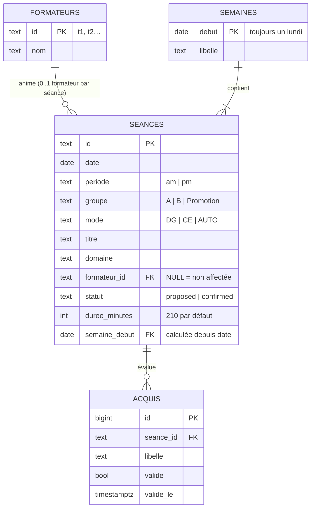

# B1 — Conception de la base MATRiCE

SGBD retenu : **PostgreSQL 17**. Schéma : [`sql/01-schema.sql`](sql/01-schema.sql) ·
opérations : [`sql/03-operations.sql`](sql/03-operations.sql) · preuves : [`preuves/`](preuves/).

## 1. Modèle



### Clés

| Table | Clé primaire | Pourquoi |
|---|---|---|
| `formateurs` | `id` (`t1`…) | identifiant déjà utilisé par le sujet et par les autres modules ; format imposé (`^t[0-9]+$`) |
| `semaines` | `debut` (le lundi) | clé naturelle stable et lisible ; une contrainte impose que ce soit un lundi |
| `seances` | `id` (`s01`…) | identifiant métier du sujet, déjà partagé avec le front (F1) et le flux (I3) |
| `acquis` | `id` auto (identité) | pas d'identifiant métier ; l'unicité métier est portée par `UNIQUE (seance_id, libelle)` |

**Clés étrangères :**
- `seances.formateur_id` vers `formateurs.id`. Elle peut être nulle : une séance proposée peut ne pas encore avoir de formateur, et une séance AUTO n'en a jamais.
- `seances.semaine_debut` vers `semaines.debut`. Cette colonne est **générée** à partir de la date (le lundi de la date). Il est donc impossible de rattacher une séance à une semaine qui ne la contient pas.
- `acquis.seance_id` vers `seances.id`, avec `ON DELETE CASCADE` : un acquis n'a pas de sens sans sa séance.

### Cardinalités

- Un formateur anime **0 à N** séances, et une séance a **0 ou 1** formateur.
- Une semaine contient **1 à N** séances (on ne crée une semaine que lorsqu'elle porte une séance), et une séance appartient à **exactement 1** semaine.
- Une séance a **0 à N** acquis, et un acquis appartient à **exactement 1** séance.
- **Contrainte de créneau** : sur un créneau (date + période), un formateur a **au plus 1** séance. C'est l'index unique décrit au § 2.

### Valeurs autorisées (contraintes `CHECK`)

| Colonne | Valeurs | Règle du sujet |
|---|---|---|
| `periode` | `am`, `pm` | demi-journées |
| `groupe` | `A`, `B`, `Promotion` | |
| `mode` | `DG`, `CE`, `AUTO` | |
| `statut` | `proposed`, `confirmed` | |
| `domaine` | `web`, `data`, `cyber`, `ia`, `design`, `projet` | domaines du planning de référence |
| `titre`, `nom`, `libelle` | non vides (espaces seuls refusés) | |
| `duree_minutes` | 30 à 300 (210 par défaut) | demi-journée de 3 h 30 |
| `semaines.debut` | un lundi | |
| *croisée* `auto_sans_formateur_et_proposee` | `mode = AUTO` ⇒ `formateur_id IS NULL` et `statut = proposed` | « AUTO impose teacherId nul et status proposed » |
| *croisée* `confirmation_exige_formateur` | `statut = confirmed` ⇒ `formateur_id IS NOT NULL` | « une confirmation exige un formateur » |
| *croisée* `date_de_validation_coherente` | `valide` ⇔ `valide_le` renseignée | |

J'ai préféré des `CHECK` à des types `ENUM`. Ils donnent un message qui nomme la règle violée, et on peut ajouter une valeur en remplaçant la contrainte dans la même migration. Avec un `ENUM`, il faudrait `ALTER TYPE … ADD VALUE`, et la nouvelle valeur n'est utilisable qu'une fois cette transaction validée.

## 2. Garantie sous concurrence

**Règle.** Un même formateur ne peut pas être affecté à deux séances différentes ayant la même date et la même période, même si deux écritures arrivent en même temps.

**Mécanisme.** Un **index unique partiel** :

```sql
CREATE UNIQUE INDEX ux_seances_formateur_creneau
  ON seances (formateur_id, date, periode)
  WHERE formateur_id IS NOT NULL;
```

**Pourquoi ça tient sous concurrence.** Quand une transaction écrit une clé `(t1, 2026-10-21, am)` dans l'index sans avoir encore validé, une seconde transaction qui veut écrire la même clé **attend** l'issue de la première :
- si la première valide (`COMMIT`), la seconde échoue avec `23505 unique_violation` ;
- si la première annule (`ROLLBACK`), la seconde passe.

Cela vaut quel que soit le niveau d'isolation, y compris le niveau par défaut (`READ COMMITTED`). La vérification et l'écriture forment une seule opération atomique, faite par le moteur.

**Pourquoi pas une vérification dans l'application.** Le schéma « je compte les séances du créneau, puis j'écris si j'en trouve 0 » échoue sous concurrence : les deux transactions lisent 0 avant que l'une ou l'autre n'ait écrit. La partie 3 du test le reproduit : sans l'index, **t1 se retrouve affecté deux fois** au même créneau.

**Alternatives écartées**

| Option | Raison |
|---|---|
| `SELECT … FOR UPDATE` avant d'écrire | ne verrouille que des lignes existantes : deux insertions de **nouvelles** séances sur le même créneau ne se bloquent pas |
| Isolation `SERIALIZABLE` | fonctionne, mais oblige l'application à rejouer les transactions en échec de sérialisation (`40001`), et toute transaction oubliée sans ce niveau contourne la règle |
| Verrou applicatif (`pg_advisory_xact_lock`) | ne protège que le code qui pense à le prendre |
| Contrainte d'exclusion `EXCLUDE USING gist` | nécessaire pour des **intervalles** horaires qui se chevauchent ; ici les créneaux sont discrets (date + am/pm), un index unique suffit et il est plus simple |

**Preuve** ([`preuves/test-concurrence.txt`](preuves/test-concurrence.txt), produite par `tests/test-concurrence.sh`, avec de vraies connexions séparées) :
- **Partie 1** : la session 2 est **bloquée environ 2 s**, exactement le temps que la session 1 garde sa transaction ouverte. Elle échoue ensuite (`23505`). État final : `c01=t1/confirmed, c02=-/proposed`.
- **Partie 2** : 3 sessions lancées simultanément sur 3 séances du même créneau : **1 succès et 2 refus**.
- **Partie 3** : contre-exemple sans index, avec une double affectation.

**Entrées invalides** ([`preuves/test-entrees-invalides.txt`](preuves/test-entrees-invalides.txt)) : 18 cas refusés, chacun avec le **code SQLSTATE attendu** vérifié (23514, 23503, 23505, 22008, P0002), et 5 cas valides acceptés. Tout se fait dans une transaction annulée.

## 3. Index

| Index | Colonnes | Sert à |
|---|---|---|
| `seances_pkey` | `id` | confirmer une affectation (UPDATE par id), jointure avec les acquis |
| `ux_seances_formateur_creneau` (unique, partiel) | `formateur_id, date, periode` où `formateur_id` n'est pas nul | **la règle de créneau** ; et, en bonus, « les séances d'un formateur sur une période » (plan 6) |
| `ix_seances_semaine` | `semaine_debut, date, periode, groupe` | lister une semaine (plans 1, 2 et 5) |
| `acquis_unique_par_seance` | `seance_id, libelle` | unicité d'un acquis dans sa séance ; sert aussi l'index de la FK (suppression en cascade) |
| `ix_acquis_valides` (partiel) | `seance_id` INCLUDE `libelle, valide_le` où `valide` | acquis validés : il ne contient que les lignes validées, et l'`INCLUDE` permet un *index-only scan* (plan 5) |

**Volontairement absents.**
- Pas d'index sur `statut`. Avec seulement 2 valeurs, il est trop peu sélectif pour qu'on l'utilise.
- Pas d'index sur `date` seule. Le calcul des heures (plan 4) lit 130 pages en environ 1 ms ; un index ralentirait chaque écriture pour un gain nul à ce volume (§ 5).

## 4. Relationnel ou documentaire ?

| Critère | PostgreSQL (retenu) | MongoDB |
|---|---|---|
| Règle formateur/créneau sous concurrence | **index unique partiel**, natif et atomique | index unique partiel possible aussi (`partialFilterExpression`), mais seulement si la séance est un document à part entière. Si les séances sont imbriquées dans la semaine, l'unicité *entre* documents devient impossible |
| Règles croisées (AUTO, confirmation) | `CHECK` dans le schéma, refus à l'écriture | `$jsonSchema` + `$expr` : possible, moins lisible, et pas appliqué aux documents déjà présents |
| Références (formateur, semaine) | clés étrangères vérifiées | aucune clé étrangère : formateur inconnu ou semaine absente acceptés |
| Requêtes transverses (heures par formateur, acquis validés) | jointures + `GROUP BY` | pipeline `$lookup`/`$group`, ou dénormaliser le nom du formateur (à resynchroniser) |
| Lecture « une semaine complète » | jointure, environ 0,1 ms (plan 1) | **un seul document** si la semaine embarque ses séances : c'est le point fort du documentaire |
| Schéma évolutif (champs libres par séance) | colonnes ou `jsonb` | naturel |

**Conclusion.** Les données sont fortement **reliées** (formateur, semaine, séance, acquis) et la règle principale est une **contrainte d'unicité entre entités**. Le relationnel la garantit nativement. En documentaire, il faudrait soit renoncer à imbriquer les séances, et perdre l'avantage du modèle, soit reporter la règle dans l'application, ce que la partie 3 du test montre fragile. Le besoin de souplesse (champs pédagogiques variables) reste couvert en PostgreSQL par une colonne `jsonb` si besoin.

## 5. Plans d'exécution commentés

Fichier complet : [`preuves/plans-execution.txt`](preuves/plans-execution.txt).

**Conditions de mesure**
- 10 006 séances, 50 formateurs, 335 semaines, 30 007 acquis, générés par `sql/04-volume.sql` de façon déterministe ;
- `VACUUM ANALYZE` lancé avant les mesures ;
- PostgreSQL 17.6 ;
- toutes les pages en cache (`shared hit`). Les temps donnent des ordres de grandeur sur une machine de développement.

1. **Planning d'une semaine.**
   - `Index Scan using ix_seances_semaine` avec `Index Cond: semaine_debut = '2024-03-04'` : **30 lignes lues sur 10 006, 4 pages**. Sans cet index, ce serait un parcours complet de 130 pages.
   - Les formateurs (50 lignes) sont chargés dans une table de hachage (`Hash Left Join`). Ce type de jointure perd l'ordre de l'index, d'où un `Sort` final : un tri rapide de 30 lignes en 27 kB de mémoire, négligeable.
   - Total : environ 0,1 ms.
2. **Formateurs d'une semaine.** Le même index alimente un `HashAggregate` (27 formateurs). Le comptage des confirmées utilise un `FILTER` dans le même passage, sans deuxième lecture.
3. **Confirmer une affectation.**
   - `Index Scan using seances_pkey` : 1 ligne, 3 pages.
   - L'`UPDATE` modifie `formateur_id`, une colonne indexée. PostgreSQL ne peut donc pas faire de mise à jour « HOT » : il met à jour chaque index, et c'est là que **l'unicité du créneau est vérifiée**.
   - La ligne `Trigger for constraint seances_formateur_id_fkey` montre la vérification de la clé étrangère (le formateur existe).
4. **Heures par formateur sur un trimestre.**
   - `Seq Scan on seances` : 9 772 lignes écartées pour 234 gardées, **130 pages, environ 1,4 ms**.
   - Le planificateur estime à juste titre que lire toute la table (petite et en cache) coûte moins cher que de suivre un index pour 2 % des lignes, dispersées.
   - `Hash Right Join` : la table des formateurs (50 lignes) sert de table de hachage, et la jointure externe garde les formateurs sans séance (0 h).
   - **À surveiller** : au-delà de quelques centaines de milliers de séances, un index `(statut, date) INCLUDE (formateur_id, duree_minutes)` permettrait un *index-only scan*. Il ne se justifie pas aujourd'hui.
5. **Acquis validés d'une semaine.**
   - `Nested Loop` : pour chacune des 30 séances de la semaine (trouvées par `ix_seances_semaine`), un `Index Only Scan using ix_acquis_valides`, avec **`Heap Fetches: 0`** : toutes les colonnes utiles sont dans l'index partiel, et la table `acquis` n'est jamais lue.
   - `Incremental Sort` : les lignes arrivent déjà triées par date et période (ordre de l'index), PostgreSQL ne trie que le reste (id, libellé).
   - Environ 0,15 ms.
6. **Créneaux d'un formateur.**
   - `Bitmap Index Scan on ux_seances_formateur_creneau` : l'index créé pour la règle d'unicité sert aussi à la lecture, puisque `formateur_id` vient en tête et la date en second. 8 lignes, 7 pages.

## 6. Limites

- La contrainte porte sur le **formateur**. Elle n'empêche pas un **groupe** d'avoir deux séances sur un même créneau, ni une séance « Promotion » de chevaucher une séance du groupe A. C'est une règle possible, mais absente du sujet. Pour la traiter, il faudrait un index unique `(groupe, date, periode)` et une contrainte d'exclusion pour le cas Promotion contre A/B.
- La durée d'une séance est fixée à 210 minutes par défaut. Les heures dépendent donc de cette convention tant que les vraies durées ne sont pas saisies.
- Pas de gestion des droits SQL (rôles applicatifs distincts du propriétaire du schéma). En production, l'API se connecterait avec un rôle qui ne peut que lire et écrire les tables, sans pouvoir modifier le schéma.
- Les preuves ont été produites avec PostgreSQL 17.6 en local (binaires officiels), et non avec le conteneur `docker-compose.yml`. Les scripts sont les mêmes ; seule la connexion (variables `PG*`) change.
