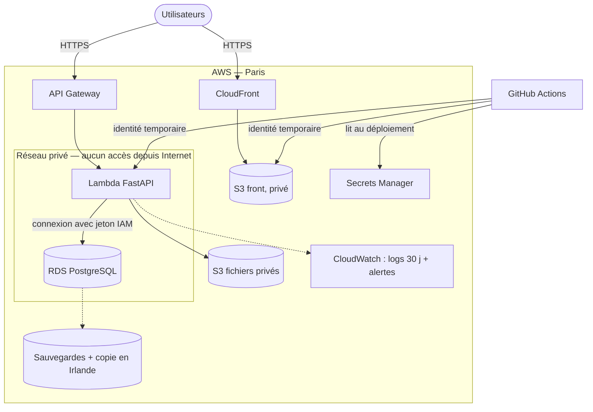

# C1 — Architecture AWS pour MATRiCE

**L'application** : un front React, une API Python (FastAPI) et une base PostgreSQL.

**Hypothèses du sujet**
- 25 utilisateurs en même temps, au maximum 20 requêtes par seconde ;
- 10 000 séances et 2 Go de fichiers privés ;
- logs gardés 30 jours ;
- **RPO 24 h** : on accepte de perdre au maximum 24 h de données ;
- **RTO 4 h** : le service doit être rétabli en moins de 4 h.

**Région choisie** : Paris (`eu-west-3`). Les données restent en France (RGPD) et c'est la région la plus proche des utilisateurs.

---

## 1. Deux architectures comparées

Le **front est le même** dans les deux cas. `npm run build` produit des fichiers statiques. Ils sont rangés dans un stockage **S3 privé** et envoyés aux navigateurs par **CloudFront**, le réseau de diffusion d'AWS. Pas besoin de serveur pour le front.

La différence est sur l'**API**.

### A — API sans serveur : API Gateway + Lambda (choisie)

```
Navigateur ──> CloudFront ──> S3 (front)
Navigateur ──> API Gateway ──> Lambda (FastAPI) ──> RDS PostgreSQL (réseau privé)
                                                 └──> S3 (fichiers privés)
```

- L'API tourne dans **Lambda** : AWS lance le code seulement quand une requête arrive, et on paie à la requête.
- La Lambda et la base sont dans un **réseau privé**, sans accès depuis Internet.
- Il n'y a **aucun serveur à maintenir**.

### B — API sur serveur : Load Balancer + EC2

```
Navigateur ──> Load Balancer ──> EC2 (FastAPI dans Docker) ──> RDS PostgreSQL
EC2 ──> NAT Gateway ──> Internet (mises à jour)
```

- L'API tourne en continu sur un serveur **EC2**.
- Un **Load Balancer** reçoit les requêtes et les transmet au serveur.
- Le serveur, placé dans un réseau privé, a besoin d'une **NAT Gateway** pour accéder à Internet (pour ses mises à jour).

### Comparaison

| | A — Lambda | B — EC2 |
|---|---|---|
| Coût par mois (§ 4) | **environ 25 $** | environ 109 $ |
| Quand personne n'utilise l'app | presque gratuit | on paie quand même 24 h/24 |
| Maintenance | aucune (AWS s'en charge) | mises à jour du serveur, de Docker… |
| Montée en charge | automatique | à configurer |
| Rapidité | la 1ʳᵉ requête après une pause prend environ 1 s | toujours rapide |
| Retour en arrière | quelques secondes | redéployer l'ancienne version |

**Choix : A.** Avec peu d'utilisateurs, surtout aux heures de cours, payer un serveur, un Load Balancer et une NAT Gateway allumés en permanence (environ 76 $/mois à eux trois) n'a pas de sens. Le seul défaut de A est la lenteur de la première requête après une pause, et le front affiche déjà un état « chargement ».

**B serait mieux** si l'API devait faire de longs traitements (plus de 15 minutes, la limite de Lambda), garder des connexions ouvertes (temps réel) ou subir une forte charge en continu.

## 2. EC2, S3, Lambda et services écartés

**Utilisés**

- **S3** : trois espaces de stockage, tous privés et chiffrés :
  - le front ;
  - les 2 Go de fichiers privés (supports de cours) ;
  - les anciennes versions du front (module C2).

  Les fichiers privés ne sont jamais publics. L'API vérifie les droits de la personne, puis donne un **lien temporaire valable 5 minutes**.
- **Lambda** : exécute l'API. On choisit des processeurs ARM, 20 % moins chers.
- **RDS PostgreSQL** : la base de données, sur la plus petite instance (`db.t4g.micro`). 10 000 séances, c'est très peu de données.
- **EC2** : **non retenu** pour l'API (voir la comparaison), mais c'est l'alternative B documentée.

**Écartés**

| Service | Pourquoi |
|---|---|
| Base en double (Multi-AZ) | double le prix de la base (+15,80 $/mois) ; le RTO de 4 h n'en a pas besoin |
| ECS Fargate (conteneurs) | facturé en continu et demande aussi un Load Balancer : presque aussi cher que B |
| Kubernetes (EKS) | beaucoup trop complexe pour une seule API |
| DynamoDB | les données sont relationnelles (voir le module B1) |
| Aurora | plus puissant que nécessaire |

## 3. Réseau, droits et secrets

### Schéma



**Ce qui est public** : uniquement CloudFront et API Gateway, en HTTPS. **Ce qui est privé** : la Lambda, la base et les fichiers. La base n'accepte que les connexions venant de la Lambda.

### Droits (IAM) : chacun a seulement ce dont il a besoin

| Qui | A le droit de |
|---|---|
| La Lambda | se connecter à la base, lire et écrire les fichiers privés, écrire ses logs |
| La CI pour le front | déposer les fichiers du site, vider le cache CloudFront |
| La CI pour l'API | publier une nouvelle version de la Lambda |
| Les personnes de l'équipe | se connecter avec leur propre compte et une double authentification (MFA). **Pas de compte partagé** |

### Secrets

- **Base de données** : **pas de mot de passe dans l'application**. La Lambda se connecte avec un jeton temporaire, fourni grâce à ses droits IAM.
- **Mot de passe administrateur de la base** : rangé dans Secrets Manager et changé automatiquement.
- **Clé de l'application** (pour les sessions) : dans Secrets Manager, transmise à la Lambda au moment du déploiement.
- **Rien dans le dépôt Git.**

**Protection de la base** : au maximum 20 Lambda tournent en même temps, donc la base ne reçoit jamais plus de 20 connexions. C'est largement suffisant : 20 requêtes par seconde de 0,15 s chacune occupent environ 3 Lambda en même temps.

## 4. Coûts estimés

**Volumes supposés**
- **2 millions de requêtes API par mois** (22 jours × 10 h × 2 requêtes/s, plus une marge) ;
- **5 Go** de front envoyés par mois ;
- **10 Go** de réponses API ;
- **3 Go** stockés dans S3 ;
- **1 Go** de logs.

Les prix viennent des **fichiers officiels de tarifs AWS** (région Paris, consultés le 2026-10-09), lus par le script `estimation/estimer-couts.mjs`. Détail ligne par ligne : [`estimation/resultat-estimation.md`](estimation/resultat-estimation.md).

| Poste (USD par mois, hors taxes) | A — Lambda | B — EC2 |
|---|---:|---:|
| Calcul de l'API (A : API Gateway + Lambda ; B : serveur EC2 + disque) | 4,74 | 15,58 |
| Réseau (B : Load Balancer + NAT Gateway + adresses IP) | 0,00 | 73,15 |
| Base RDS + 20 Go de stockage | 15,80 | 15,80 |
| Copie des sauvegardes en Irlande | 0,30 | 0,30 |
| Stockage S3 | 0,16 | 0,16 |
| Trafic sortant (front + API) | 1,39 | 1,39 |
| Logs et alertes | 1,23 | 1,23 |
| Secrets Manager (2 secrets) | 0,80 | 0,80 |
| Nom de domaine (Route 53) | 0,90 | 0,90 |
| **Total** | **25,32** | **109,31** |

**À retenir**
- Dans A, **la base représente 62 % du coût**.
- Dans B, la **NAT Gateway coûte à elle seule plus cher que toute l'architecture A**.
- L'offre gratuite d'AWS n'est **pas déduite** : la vraie facture de A serait encore plus basse.

**Sources** : fichiers `https://pricing.us-east-1.amazonaws.com/offers/v1.0/aws/<service>/current/eu-west-3/index.json`, publiés entre le 2026-09-11 et le 2026-10-08. La date exacte de chaque fichier est indiquée dans `resultat-estimation.md`.

## 5. Logs, alertes, sauvegardes, retour arrière

**Logs** : ceux de la Lambda, d'API Gateway et de la base, gardés **30 jours** (CloudWatch). Ils ne contiennent ni mot de passe ni donnée personnelle.

**Alertes** (par e-mail)

| Alerte | Quand |
|---|---|
| Erreurs de l'API | plus de 2 % d'erreurs en 5 minutes |
| Erreurs de la Lambda | 5 erreurs ou plus en 5 minutes |
| Lambda saturée | la limite de 20 est atteinte |
| Base surchargée | processeur à plus de 80 % pendant 15 minutes |
| Base presque pleine | moins de 2 Go libres |
| Coût | facture prévue au-dessus de 40 $ |

**Sauvegardes**
- **Base** : sauvegarde automatique, gardée 7 jours, qui permet de **revenir à n'importe quel moment** (à 5 minutes près).
- Une **copie chaque nuit en Irlande**, au cas où toute la région de Paris tomberait en panne.
- **Fichiers S3** : les anciennes versions sont gardées 30 jours. Un fichier supprimé par erreur peut être récupéré.
- **Front** : les anciennes versions sont archivées (module C2).

**Retour arrière**
- **Front** : on remet une ancienne version archivée (module C2), en environ 2 minutes.
- **API** : chaque déploiement crée une version numérotée de la Lambda. Revenir en arrière, c'est pointer vers la version précédente, et cela prend quelques secondes.
- **Base** : les changements de structure sont faits en deux étapes (on ajoute d'abord, on supprime plus tard). Une ancienne version de l'API marche donc encore avec la nouvelle base.

## 6. En cas d'incident

### API indisponible

| Étape | Que faire | Délai |
|---|---|---|
| 1. Repérer | alerte reçue ou signalement d'un utilisateur. Le front affiche une erreur avec « Réessayer » | 5 min |
| 2. Comprendre | regarder les logs : livraison récente ? base en panne ? problème chez AWS ? | 10 min |
| 3a. Problème après une livraison | revenir à la version précédente de la Lambda | 5 min |
| 3b. Lambda saturée | vérifier que ce n'est pas une attaque, sinon augmenter la limite | 10 min |
| 3c. Base en panne | redémarrer la base ; si elle est perdue, la restaurer (voir ci-dessous) | 15 min à 1 h |
| 3d. Panne de toute la région AWS | si elle dure plus de 2 h, tout redémarrer en Irlande | jusqu'à 4 h |
| 4. Clôturer | vérifier que tout marche, prévenir les utilisateurs, écrire ce qui s'est passé | 2 jours |

### Restaurer la base

1. Choisir le moment à restaurer (juste avant le problème).
2. Restaurer la base **dans une nouvelle instance**, sans toucher à l'ancienne :
   `aws rds restore-db-instance-to-point-in-time --source-db-instance-identifier matrice-db --target-db-instance-identifier matrice-db-restore --restore-time <date>`
3. Vérifier : nombre de séances, dernières séances créées.
4. Faire pointer l'API vers la nouvelle base.
5. Supprimer l'ancienne après 7 jours.

**Tester la restauration tous les 3 mois**, sinon on ne sait pas si les sauvegardes fonctionnent.

### RPO et RTO

| Situation | Données perdues (objectif : 24 h max) | Temps de coupure (objectif : 4 h max) |
|---|---|---|
| Bug après une livraison | aucune | quelques minutes |
| Données supprimées par erreur | environ 5 min | environ 1 h |
| Panne de la base ou d'un centre de données | environ 5 min | environ 1 h |
| Panne de toute la région de Paris | 24 h au maximum (copie de la nuit) | 2 à 4 h |

**Les objectifs sont respectés** dans tous les cas. Une base en double (Multi-AZ) réduirait la coupure d'environ 1 h à 1-2 minutes, mais elle coûterait 62 % de plus, alors que le RTO de 4 h ne le demande pas.

## 7. Limites

- Les prix sont ceux « à la demande », hors taxes, sans réduction ni offre gratuite.
- Les volumes sont des estimations, à vérifier après un mois d'utilisation réelle.
- Le temps de démarrage de la Lambda (environ 1 s) et la durée de restauration (environ 1 h) sont des ordres de grandeur, à mesurer.
