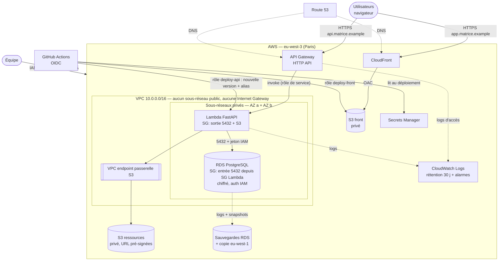

# C1 — Architecture AWS pour MATRiCE

**Application** : front React (Vite), API Python (FastAPI), base PostgreSQL.

**Hypothèses du sujet**
- 25 utilisateurs simultanés, pointe à 20 requêtes/s ;
- 10 000 séances ;
- 2 Go de ressources privées ;
- logs conservés 30 jours ;
- **RPO 24 h**, **RTO 4 h**.

**Région** : `eu-west-3` (Paris). Elle garde les données en France, ce qui compte pour le RGPD (données de stagiaires), et offre la latence la plus faible pour les utilisateurs.

Aucun compte ni déploiement réel (hors périmètre). Tarifs : AWS Price List API, extraits le 2026-10-09 (§ 4).

---

## 1. Deux architectures comparées

Le **front est identique** dans les deux cas : `npm run build` produit des fichiers statiques, déposés dans un bucket **S3 privé** et servis par **CloudFront** avec un accès d'origine restreint (OAC). Aucun serveur n'est nécessaire pour le front. C'est la cible de livraison du module C2. La différence entre les deux architectures porte sur l'**API**.

### A — API sans serveur : API Gateway + Lambda (retenue)

```
Navigateur ──HTTPS──> CloudFront ──OAC──> S3 « front » (privé)
Navigateur ──HTTPS──> API Gateway (HTTP API) ──> Lambda FastAPI (arm64, 512 Mo, dans le VPC)
                                                   ├──5432, auth IAM──> RDS PostgreSQL (sous-réseau privé)
                                                   └──endpoint passerelle──> S3 « ressources » (privé)
```

- FastAPI tourne dans **Lambda** via l'adaptateur ASGI `Mangum`. Le code de l'API ne change pas.
- La fonction est rattachée à **deux sous-réseaux privés** (deux zones de disponibilité), sans route vers Internet.
- Elle atteint la base par le réseau privé et S3 par un **VPC endpoint de type passerelle**, qui est gratuit. Il n'y a donc **ni NAT Gateway, ni sous-réseau public, ni serveur à maintenir**.

### B — API sur serveur : ALB + EC2

```
Navigateur ──HTTPS──> ALB (sous-réseaux publics) ──> EC2 t4g.small, Docker + FastAPI (sous-réseau privé, ASG min=max=1)
EC2 ──> NAT Gateway ──> Internet (mises à jour, image Docker, Secrets Manager)
EC2 ──5432──> RDS PostgreSQL (sous-réseau privé)
```

- FastAPI tourne en continu (Gunicorn + Uvicorn) sur une instance **EC2**.
- Elle est placée dans un groupe Auto Scaling de taille 1, ce qui la recrée automatiquement si elle tombe.
- Un **Application Load Balancer** termine le HTTPS.
- L'instance, en sous-réseau privé, a besoin d'une **NAT Gateway** pour ses mises à jour et pour joindre les API AWS.

### Comparaison

| Critère | A — Lambda | B — EC2 |
|---|---|---|
| Coût mensuel estimé (§ 4) | **≈ 25 $** | ≈ 109 $ (× 4,3) |
| Coût au repos (nuit, vacances) | quasi nul pour l'API : paiement à la requête | ALB + EC2 + NAT facturés 24 h/24 |
| Exploitation | pas d'OS à patcher ; AWS gère la disponibilité | correctifs OS, image Docker, supervision de l'instance |
| Montée en charge | automatique (plafonnée volontairement, voir § 3) | manuelle ou par règles ASG |
| Latence | **démarrage à froid** d'environ 1 s après inactivité | constante |
| Connexions à la base | une par environnement Lambda : à plafonner | un pool stable |
| Limites | 15 min max par requête, 6 Mo par réponse synchrone | aucune contrainte de ce type |
| Retour arrière | changement d'alias de version en quelques secondes | redéploiement d'une image précédente |

**Choix : A.** Avec 20 requêtes/s en pointe et une activité concentrée sur les heures de formation, payer un ALB, une NAT Gateway et une instance allumés en permanence n'a pas de sens : ces trois postes coûtent à eux seuls environ 76 $/mois (ALB 25,45 + NAT 36,75 + EC2 13,72). Le démarrage à froid est le vrai défaut de A. Il ne touche que la première requête après une période d'inactivité, et le front affiche déjà un état de chargement (module F1). Si cela devenait gênant, on pourrait ajouter de la *provisioned concurrency* sur une seule instance, pendant les heures ouvrées uniquement. **B redeviendrait pertinente** dans trois cas : traitements longs (au-delà de 15 min), connexions persistantes (WebSocket), ou charge soutenue en continu, où un serveur toujours allumé finit par coûter moins cher que la facturation à la requête.

## 2. EC2, S3, Lambda et services écartés

**Retenus**

- **S3.** On l'utilise pour trois usages :
  - le bucket « front » (fichiers statiques) ;
  - le bucket « ressources » (les 2 Go privés : supports de cours, pièces jointes) ;
  - le bucket « releases » (archive des versions du front, module C2).

  Les trois sont privés (*Block Public Access*), chiffrés (SSE-S3) et versionnés. Les ressources privées ne sont **jamais publiques** : l'API vérifie les droits de la personne, puis renvoie une **URL pré-signée valable 5 minutes**.
- **Lambda.** Elle exécute l'API, comme décrit plus haut. Le choix de l'architecture arm64 (Graviton) réduit le prix du calcul d'environ 20 % par rapport à x86 (0,0000133334 $ contre 0,0000166667 $ par Go-s).
- **EC2.** Il est **écarté** pour l'API (voir la comparaison), mais reste l'alternative documentée (B). On pourrait le réutiliser ponctuellement, par exemple pour un bastion de maintenance, mais **Session Manager** le rend inutile.
- **RDS PostgreSQL** `db.t4g.micro` Single-AZ, avec 20 Go en gp3. 10 000 séances représentent quelques mégaoctets : la plus petite instance Graviton suffit largement, et le moteur reste identique à celui utilisé en développement.

**Écartés**

| Service | Raison |
|---|---|
| **RDS Multi-AZ** | double le prix de la base (0,036 $/h au lieu de 0,018 $/h, stockage à 0,266 $/Go au lieu de 0,133 $), soit +15,80 $/mois, pour une bascule en 1 à 2 minutes. Le RTO de 4 h n'exige pas cela : une restauration dans une autre zone suffit (§ 6) |
| **ECS Fargate** | conteneurs sans serveur à gérer, mais facturés en continu, et qui demandent quand même un ALB et une NAT (ou une IP publique) : on retrouve la plupart des coûts fixes de B |
| **App Runner / Elastic Beanstalk** | plus simples que B, mais avec les mêmes coûts fixes et moins de contrôle sur le réseau |
| **EKS (Kubernetes)** | facturation fixe du plan de contrôle et complexité d'exploitation disproportionnées pour une API |
| **Aurora** | ses atouts (réplicas, stockage distribué) n'apportent rien à cette charge ; RDS PostgreSQL est plus simple et prévisible |
| **DynamoDB** | les données sont relationnelles (séances, formateurs, acquis, contraintes d'unicité, voir module B1) : pas de raison de quitter PostgreSQL |
| **RDS Proxy** | utile si des centaines d'environnements Lambda ouvrent des connexions ; ici, on plafonne la concurrence (§ 3), ce qui revient moins cher |
| **VPC endpoints d'interface** (Secrets Manager…) | 0,011 $/h par endpoint et par zone, soit environ 16 $/mois pour un seul service sur deux zones. On s'en passe grâce à l'authentification IAM à la base (§ 3) |

## 3. Réseau, identités, secrets

### Schéma



**Ce qui est public** : uniquement les points d'entrée gérés par AWS, c'est-à-dire CloudFront et API Gateway, tous deux en HTTPS. **Ce qui est privé** : la fonction, la base et les buckets. La base n'a pas d'adresse publique, et son groupe de sécurité n'accepte le port 5432 que depuis le groupe de sécurité de la Lambda.

### IAM : une identité par usage, droits minimaux

| Identité | Droits | Remarque |
|---|---|---|
| Rôle d'exécution Lambda | `rds-db:connect` sur l'utilisateur `matrice_app` ; `s3:GetObject`/`PutObject` sur `ressources/*` ; écriture dans son groupe de logs ; interfaces réseau du VPC | ne peut ni lire le bucket front, ni administrer la base |
| `deploy-front` (OIDC GitHub, module C2) | `s3:PutObject`/`DeleteObject` sur le bucket front et `releases/front/*` ; `cloudfront:CreateInvalidation` | utilisable seulement depuis l'environnement GitHub `production` du dépôt |
| `deploy-api` (OIDC GitHub) | `lambda:UpdateFunctionCode`, `PublishVersion`, `UpdateAlias` sur la seule fonction ; `secretsmanager:GetSecretValue` sur le secret applicatif | idem |
| Personnes | IAM Identity Center, **MFA obligatoire** ; groupe « lecture » par défaut ; rôle d'administration temporaire et tracé (CloudTrail) | **aucun compte partagé**, aucune clé d'accès longue durée, compte root sous coffre et jamais utilisé |

### Secrets

- **Base de données : aucun mot de passe applicatif.** La Lambda s'authentifie avec un **jeton IAM** de 15 minutes, généré localement grâce à son rôle. Il n'y a donc pas de secret à stocker ni à faire tourner, et pas d'appel réseau vers Secrets Manager depuis le VPC.
- **Mot de passe maître RDS** : il est **géré par RDS dans Secrets Manager**, avec rotation automatique. Il ne sert qu'aux migrations et aux interventions.
- **Clé de signature des sessions** de l'API : elle est stockée dans Secrets Manager. La CI la lit au déploiement et l'injecte en variable d'environnement Lambda, chiffrée au repos par KMS. Ce compromis évite un endpoint d'interface payant. En contrepartie, une rotation demande un redéploiement, ce qui est acceptable pour une clé changée quelques fois par an.
- **Rien dans le dépôt Git** : seulement un `.env.example`.

### Protection de la base contre la surcharge

La *reserved concurrency* de la Lambda est fixée à **20**. D'après la loi de Little, 20 requêtes/s × 0,15 s donnent environ 3 exécutions simultanées en pointe : le plafond de 20 laisse donc une marge de × 6. Comme chaque exécution garde au plus une connexion, la base ne voit jamais plus de 20 connexions applicatives, bien en dessous du maximum d'une `db.t4g.micro`. Au-delà, API Gateway renvoie une erreur 429 plutôt que d'écrouler la base.

## 4. Estimation des coûts

**Volumes supposés**, déduits des hypothèses du sujet :
- **Requêtes API** : 22 jours ouvrés × 10 h × 2 requêtes/s en moyenne, soit environ 1,6 million, arrondi à **2 millions par mois**.
- **Calcul Lambda** : 150 ms × 512 Mo par requête.
- **Front** : environ 300 Ko par chargement à froid, pour environ 200 personnes (promotion + formateurs) et 2 chargements par jour, soit 2,6 Go, arrondi à **5 Go**.
- **Réponses de l'API** : environ 5 Ko × 2 millions, soit **10 Go**.
- **Stockage S3** : 2 Go de ressources + versions + front, arrondis à **3 Go**.
- **Logs** : environ 1 Go ingéré par mois, et environ 1 Go stocké avec une rétention de 30 jours.

Le calcul est **reproductible** : `node estimation/estimer-couts.mjs`. Ce script télécharge les fichiers d'offres officiels d'AWS (*Price List Bulk API*), extrait chaque prix unitaire et imprime le détail ligne par ligne, avec la date de publication de chaque source. Sortie complète : [`estimation/resultat-estimation.md`](estimation/resultat-estimation.md).

| Poste (USD / mois, prix à la demande, hors taxes) | A — Lambda | B — EC2 |
|---|---:|---:|
| Calcul API (A : API Gateway 2,34 + Lambda 2,40 ; B : EC2 t4g.small 13,72 + EBS 1,86) | 4,74 | 15,58 |
| Réseau d'entrée (B : ALB 19,32 + LCU 6,13 ; NAT 36,75 ; IPv4 publiques 10,95) | 0,00 | 73,15 |
| Base RDS db.t4g.micro + 20 Go gp3 | 15,80 | 15,80 |
| Sauvegarde hors région (copie de snapshots vers eu-west-1) | 0,30 | 0,30 |
| Stockage S3 + requêtes | 0,16 | 0,16 |
| Trafic sortant (CloudFront 0,49 + API vers Internet 0,90) | 1,39 | 1,39 |
| Logs, stockage des logs, 6 alarmes | 1,23 | 1,23 |
| Secrets Manager (2 secrets) | 0,80 | 0,80 |
| Route 53 (zone + requêtes) | 0,90 | 0,90 |
| **Total** | **25,32** | **109,31** |

**Lecture**
- Dans **A**, la base représente 62 % du coût : c'est le seul poste fixe.
- Dans **B**, la **NAT Gateway coûte à elle seule plus que toute l'architecture A**.
- L'offre gratuite d'AWS (1 million de requêtes Lambda par mois, 1 To de CloudFront, 100 Go de sortie Internet…) n'est **pas déduite**. La facture réelle de A serait donc encore plus basse.
- Les sauvegardes RDS dans la région ne coûtent rien tant qu'elles restent sous la taille de la base. Avec 20 Go provisionnés, c'est le cas ici.

**Sources** (*AWS Price List Bulk API*, `https://pricing.us-east-1.amazonaws.com/offers/v1.0/aws/…`, consultée le 2026-10-09) :

| Service | Fichier d'offre | Publié le |
|---|---|---|
| Lambda | `AWSLambda/current/eu-west-3/index.json` | 2026-10-01 |
| API Gateway | `AmazonApiGateway/current/eu-west-3/index.json` | 2026-10-02 |
| RDS | `AmazonRDS/current/eu-west-3/index.json` | 2026-10-06 |
| EC2 (instances, EBS, NAT) | `AmazonEC2/current/eu-west-3/index.json` | 2026-10-08 |
| Elastic Load Balancing | `AWSELB/current/eu-west-3/index.json` | 2026-09-11 |
| VPC (IPv4 publiques) | `AmazonVPC/current/eu-west-3/index.json` | 2026-09-17 |
| S3 | `AmazonS3/current/eu-west-3/index.json` | 2026-09-28 |
| CloudFront | `AmazonCloudFront/current/index.json` | 2026-10-03 |
| Transfert de données | `AWSDataTransfer/current/eu-west-3/index.json` | 2026-09-16 |
| CloudWatch | `AmazonCloudWatch/current/eu-west-3/index.json` | 2026-10-07 |
| Secrets Manager | `AWSSecretsManager/current/eu-west-3/index.json` | 2026-09-11 |
| Route 53 | `AmazonRoute53/current/index.json` | 2026-09-11 |

## 5. Logs, alertes, sauvegardes, retour arrière

**Logs.** On collecte trois sources : les logs de la Lambda (JSON structuré : identifiant de requête, route, durée, statut), les logs d'accès d'API Gateway et le journal PostgreSQL exporté vers CloudWatch. Tous ces groupes de logs ont une **rétention de 30 jours**, définie dans l'infrastructure-as-code (sinon, la rétention par défaut est illimitée). Les logs **ne contiennent ni jeton ni donnée personnelle** : on journalise les identifiants, pas les noms. CloudTrail trace les actions sur le compte.

**Alertes** (6 alarmes CloudWatch, notification par e-mail via SNS) :

| Alarme | Seuil | Ce qu'elle signale |
|---|---|---|
| Erreurs 5xx d'API Gateway | > 2 % sur 5 min | API indisponible ou en erreur |
| Erreurs Lambda | ≥ 5 sur 5 min | bug ou régression après une livraison |
| Throttles Lambda | ≥ 1 sur 5 min | le plafond de 20 exécutions est atteint |
| CPU de RDS | > 80 % pendant 15 min | requête lente, index manquant |
| Espace libre de RDS | < 2 Go | base presque pleine |
| Facturation estimée (métrique `EstimatedCharges`) | > 40 $ sur le mois | dérive de coût, boucle, abus |

**Sauvegardes.**
- **RDS** : sauvegardes automatiques conservées **7 jours**, avec **restauration à un instant précis** (*point-in-time recovery*). Les journaux de transactions sont archivés toutes les 5 minutes environ, donc le RPO réel est d'environ 5 minutes, bien inférieur aux 24 h exigées.
- **Copie hors région** : un **plan AWS Backup** copie chaque nuit un snapshot vers `eu-west-1` (Irlande), conservé 35 jours. Il couvre la perte complète de la région de Paris.
- **S3 ressources** : versionné, avec suppression des anciennes versions au bout de 30 jours. Un fichier écrasé ou supprimé par erreur se récupère.
- **Front** : l'archive des versions (`releases/`) du module C2 sert de sauvegarde.
- **Infrastructure** : décrite en code (Terraform ou CloudFormation), et donc reconstructible dans une autre région.

**Retour arrière.**
- **Front** : on redéploie une version archivée (workflow C2, `workflow_dispatch`), ce qui prend environ 2 minutes.
- **API** : chaque déploiement publie une **version Lambda numérotée** et déplace l'alias `live`, sur lequel pointe API Gateway. Revenir en arrière, c'est remettre l'alias sur la version précédente : `aws lambda update-alias --function-name matrice-api --name live --function-version <N-1>`. C'est instantané et ne demande aucune reconstruction.
- **Base** : les migrations suivent la règle *expand/contract*. On ajoute d'abord les nouvelles colonnes ; on ne supprime les anciennes qu'une version plus tard. Ainsi, la version N-1 de l'API fonctionne encore avec le schéma N, et un retour arrière du code n'exige jamais de retour arrière de la base. En cas de migration destructrice ratée, on applique la procédure de restauration (§ 6.2).

## 6. Protocoles d'incident et discussion RPO / RTO

### 6.1 API indisponible

| Étape | Action | Délai visé |
|---|---|---|
| 1. Détecter | alarme 5xx ou erreurs Lambda, ou signalement d'utilisateur. Le front affiche l'état d'erreur avec « Réessayer » (module F1) : rien n'est perdu côté utilisateur | 5 min |
| 2. Qualifier | tableau de bord CloudWatch : une livraison récente ? Des throttles ? Des erreurs de connexion à la base ? Un incident AWS en cours (*AWS Health Dashboard*) ? | 10 min |
| 3a. Régression après livraison | **retour arrière de l'alias Lambda** sur la version précédente, puis vérification sur `GET /health` | 5 min |
| 3b. Throttles | vérifier qu'il ne s'agit pas d'un abus (logs d'accès) ; sinon, relever temporairement la *reserved concurrency* | 10 min |
| 3c. Base injoignable ou saturée | événements RDS ; redémarrage de l'instance ; si l'instance ou la zone est perdue, **procédure 6.2** | 15 min à 1 h |
| 3d. Panne régionale AWS | communiquer, attendre la reprise ; si l'interruption dépasse 2 h, **bascule vers eu-west-1** (6.2, variante régionale) | jusqu'à 4 h |
| 4. Clôturer | vérifier les métriques revenues à la normale, informer les utilisateurs, rédiger un post-mortem (cause, chronologie, action corrective) | J+2 |

### 6.2 Restauration de la base

1. **Choisir l'instant T** : juste avant l'incident (d'après les logs), ou le dernier instant restaurable en cas de perte de l'instance.
2. **Restaurer dans une nouvelle instance**, sans jamais écraser l'ancienne, qui reste pour l'analyse :
   `aws rds restore-db-instance-to-point-in-time --source-db-instance-identifier matrice-db --target-db-instance-identifier matrice-db-restore --restore-time <T>`
   Préciser le même groupe de sous-réseaux et le même groupe de sécurité, et une autre zone si la zone d'origine est en cause.
3. **Contrôler** : nombre de séances et de formateurs, dernière séance créée avant T, test de la contrainte d'unicité formateur/créneau (module B1).
4. **Basculer** : publier une version Lambda qui pointe vers le nouvel hôte (variable d'environnement), puis déplacer l'alias `live`. Le front ne change pas.
5. **Après 7 jours sans problème**, supprimer l'ancienne instance, après un dernier snapshot.

**Variante régionale.** Si la région est perdue, on recrée l'infrastructure en `eu-west-1` avec l'infrastructure-as-code, on restaure le dernier snapshot copié, on redéploie le front et l'API depuis les artefacts (C2), puis on bascule les enregistrements DNS dans Route 53.

**Tester la procédure.** Une **restauration à blanc chaque trimestre** dans une instance jetable, chronométrée, avec les contrôles de l'étape 3. Une sauvegarde jamais restaurée en test ne prouve rien. Le module C2 fait le même constat.

### 6.3 RPO et RTO

| Scénario | Perte de données (objectif RPO 24 h) | Durée d'interruption (objectif RTO 4 h) |
|---|---|---|
| Bug applicatif, livraison ratée | aucune | quelques minutes (retour de l'alias) |
| Données corrompues ou supprimées par erreur | ≈ 5 min (restauration à l'instant précis) | ≈ 1 h : restauration + contrôles + bascule |
| Perte de l'instance ou de la zone (Single-AZ) | ≈ 5 min | ≈ 1 h : restauration dans l'autre zone |
| Perte de la région Paris | ≤ 24 h (copie nocturne) | 2 à 4 h, **à condition** que l'infrastructure-as-code soit à jour et la procédure répétée |

**Lecture.**
- Les objectifs sont **largement tenus** pour les incidents courants.
- La perte d'une région est le seul scénario qui atteint les limites, et elle est rare.
- Le choix **Single-AZ** est assumé : le Multi-AZ ramènerait l'interruption d'environ 1 h à 1-2 minutes, ce que le RTO de 4 h ne demande pas, pour +15,80 $/mois, soit +62 % de la facture.
- Si l'organisation durcissait ses exigences (RTO inférieur à 1 h), ce serait la première évolution à faire, avant toute autre.

## 7. Limites

- Estimation **à la demande**, hors taxes, en USD, sans offre gratuite ni engagement. Un *Savings Plan* ou une instance RDS réservée baisserait le poste base, mais engage sur 1 à 3 ans.
- Les volumes sont des **hypothèses** (§ 4) : à remplacer par des mesures CloudWatch après un mois d'usage.
- Le stockage des snapshots en Irlande est estimé au tarif de Paris (0,10 $/Go-mois), ce qui est négligeable à cette taille.
- La durée de démarrage à froid (environ 1 s) et le délai de restauration (environ 1 h) sont des **ordres de grandeur** : ils doivent être mesurés lors du premier déploiement et de la première restauration à blanc.
