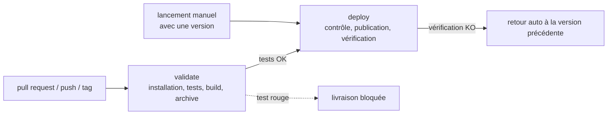

# C2 — Note CI/CD

Workflow : [`.github/workflows/front-ci-cd.yml`](.github/workflows/front-ci-cd.yml) · traces : [`preuves/`](preuves/)

Le projet pris en exemple est le front React du dépôt (`react-app/`) : `npm ci`, `npm test -- --run`, `npm run build`, résultat dans `dist/`. L'hébergement est imaginaire : le site est déposé dans un stockage S3 et servi par CloudFront (AWS).

## 1. Ce qui n'allait pas, et ce que je propose

| Problème actuel | Risque | Solution |
|---|---|---|
| Un compte administrateur partagé | on ne sait pas qui a fait quoi ; s'il fuite, tout est accessible | plus personne ne livre à la main ; la CI utilise une identité AWS temporaire, avec des droits limités |
| Le serveur récupère directement la branche `main` | on peut livrer du code jamais testé | le serveur reçoit uniquement une version **déjà construite et testée** |
| Installation non verrouillée | deux livraisons du même code n'ont pas les mêmes dépendances | `npm ci` installe exactement les versions de `package-lock.json` |
| Tests non bloquants | un test rouge n'empêche pas la livraison | si un test échoue, la livraison **ne se lance pas** |
| Secrets dans le dépôt | toute personne qui lit le dépôt peut les utiliser | **aucun secret stocké** ; les anciens secrets doivent être changés |
| Aucune ancienne version gardée | impossible de revenir en arrière | chaque version est **archivée et ne peut plus être modifiée** |
| Sauvegardes jamais testées | on ne sait pas si elles marchent | le retour arrière utilise le même chemin que la livraison, il est donc testé à chaque fois |

## 2. Comment fonctionne la chaîne

**Quand elle se lance**
- **pull request** : seulement les tests (validation) ;
- **push sur `main`** : tests, puis livraison en préproduction ;
- **tag `v1.2.0`** : tests, puis livraison en production après accord d'une personne ;
- **lancement manuel** avec un numéro de version : retour à cette version.

**Job `validate`**
1. récupère le code ;
2. installe avec `npm ci` (versions verrouillées) ;
3. vérifie les failles connues des dépendances (`npm audit`) ;
4. lance les tests ;
5. construit le site ;
6. crée l'archive versionnée (`front-v1.2.0.tar.gz`) et son empreinte (`.sha256`), qui sert à vérifier qu'elle n'a pas été modifiée.

**Job `deploy`** (seulement si `validate` a réussi)
1. archive la version (refus si elle existe déjà) ;
2. **contrôle avant livraison** : l'empreinte doit correspondre, et la version écrite dans l'archive doit être la bonne ;
3. publie le site ;
4. vérifie que le site répond et affiche la bonne version ;
5. si cette vérification échoue, remet automatiquement la version précédente.

## 3. Sécurité

- **Droits minimaux** : par défaut, le workflow peut seulement lire le code. Seul le job de livraison peut demander une identité AWS temporaire.
- **Aucun secret stocké** : l'accès à AWS se fait avec une identité temporaire (OIDC), sans clé enregistrée.
- **Code venant de l'extérieur** (une pull request depuis un fork) : il est testé, mais il n'a accès à aucun secret et ne peut jamais déclencher de livraison.
- **Production protégée** : une personne nommée doit valider chaque livraison en production.
- **Autres protections** : `npm ci --ignore-scripts` (les dépendances ne peuvent pas exécuter de script), la branche `main` est protégée, et toute modification du workflow doit être relue.

## 4. Validation séparée de la livraison

| | validate | deploy |
|---|---|---|
| Quand | pull request, `main`, tag | `main`, tag, lancement manuel — **jamais** une pull request |
| Droits | lecture du code | lecture + identité AWS temporaire |
| Produit | l'archive testée | le site en ligne |

## 5. Revenir à la version précédente

**Automatique** : si la vérification après livraison échoue, la version précédente est remise.

**Manuel**
1. Trouver la dernière version qui marchait (liste des versions archivées).
2. Dans GitHub, *Actions → front-ci-cd → Run workflow*, et indiquer la version (par exemple `v1.3.2`).
3. La chaîne récupère l'archive, vérifie son empreinte et la publie. **Rien n'est reconstruit** : on remet exactement ce qui avait été testé.
4. Corriger le problème ensuite, tranquillement.

## 6. Preuves

| Trace | Ce qu'elle montre |
|---|---|
| `actionlint.txt` | le workflow est valide (0 erreur avec l'outil actionlint) |
| `trace-1-succes-v1.0.0.txt` | une livraison réussie : installation, 13 tests verts, build, archive, publication |
| `trace-2-succes-v1.1.0.txt` | une deuxième livraison ; l'ancienne version reste archivée |
| `trace-3-echec-v1.2.0.txt` | **un test échoue, donc rien n'est livré** : la version en ligne ne change pas |
| `trace-4-rollback-v1.0.0.txt` | **retour à une version précédente**, sans rien reconstruire |
| `trace-5-refus-republication-v1.1.0.txt` | une version déjà publiée ne peut pas être écrasée |

**Réel ou simulé ?** Les traces viennent du script `simulation/simuler-pipeline.sh`.
- **Réellement exécuté** : l'installation, les tests, le build, l'archive et l'empreinte. Ce sont les mêmes commandes que dans le workflow.
- **Simulé** : S3 et CloudFront sont remplacés par des dossiers locaux. Pour l'échec, un faux test est ajouté dans une copie temporaire du projet ; le vrai projet n'est pas modifié.

## 7. Limites

- Le workflow n'a jamais tourné sur GitHub, car le sujet l'interdit. Il est vérifié par actionlint et rejoué en local.
- La vérification après livraison contrôle que le site répond, pas que chaque fonctionnalité marche.
- Pour la base de données, il faudrait en plus tester régulièrement la restauration des sauvegardes.
