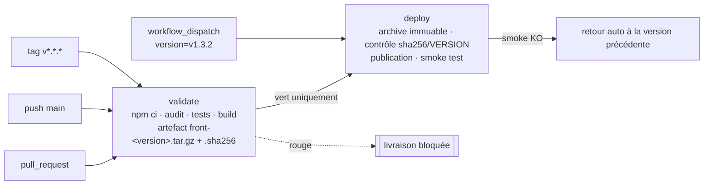

# C2 — Note CI/CD : livraison du front MATRiCE

Workflow : [`.github/workflows/front-ci-cd.yml`](.github/workflows/front-ci-cd.yml) ·
Simulation locale : [`simulation/simuler-pipeline.sh`](simulation/simuler-pipeline.sh) ·
Traces : [`preuves/`](preuves/)

Le front pris comme exemple est celui du dépôt (`react-app/`, React + Vite) : `npm ci`,
`npm test -- --run`, `npm run build`, sortie `dist/`. L'hébergement cible est hypothétique :
un bucket S3 privé servi par CloudFront, plus un second bucket qui archive toutes les versions.

## 1. Audit de la situation actuelle

| Constat | Risque | Réponse dans la chaîne |
|---|---|---|
| Compte administrateur partagé | impossible de savoir qui a livré quoi ; une fuite donne tous les droits | aucune personne ne livre à la main ; la CI prend une **identité AWS temporaire (OIDC)** limitée à un rôle de déploiement ; l'approbation de la production est nominative (environnement GitHub) |
| `git pull` de `main` directement sur le serveur | on livre du code non testé, non construit, et le serveur dépend de GitHub et de npm | le serveur ne reçoit qu'un **artefact déjà construit et testé** ; aucun outil de build sur la cible |
| Installation non verrouillée (`npm install`) | deux livraisons du même commit n'ont pas les mêmes dépendances | **`npm ci`** : échoue si `package-lock.json` est désynchronisé, installe exactement le lock |
| Tests non bloquants | un test rouge n'empêche pas la livraison | tests dans le job `validate`, **sans `continue-on-error`** ; `deploy` dépend de `validate` (`needs`) |
| Secrets dans le dépôt | toute personne ayant lu le dépôt (ou son historique) peut les utiliser | **aucun secret** : OIDC à la place de clés AWS ; noms de buckets et ARN du rôle en *variables* d'environnement (non sensibles). Les secrets déjà commités doivent être **révoqués** (les supprimer de l'historique ne suffit pas) |
| Aucun artefact antérieur | pas de retour arrière possible, sauf reconstruire un ancien commit (avec d'autres dépendances) | chaque version est un **tar.gz + empreinte SHA-256** archivé, **immuable** (refus de réécrire une version) |
| Sauvegardes jamais restaurées | personne ne sait si elles fonctionnent | le rollback emprunte **le même job** que la livraison : il est exercé à chaque déploiement ; voir § 6 pour la base |

## 2. La chaîne proposée



**Déclencheurs.**
- `pull_request` vers `main` : validation seule, même depuis un fork.
- `push` sur `main` : validation, puis livraison en **staging**.
- tag `v*.*.*` : validation, puis livraison en **production**, après approbation.
- `workflow_dispatch` avec une version : **rollback** manuel vers une version déjà archivée.

**Version de l'artefact.** Un tag donne une version comme `v1.4.0`, un commit de `main` donne `main-<sha court>`. La version, le commit et l'empreinte voyagent avec l'artefact (`dist/VERSION`, `dist/COMMIT`, `.sha256`). Rien ne s'appelle jamais « latest ».

**Contrôle avant livraison.** Le job `deploy` ne reconstruit rien. Il :
1. vérifie l'empreinte SHA-256 de l'archive ;
2. vérifie que `index.html` est présent ;
3. vérifie que la version embarquée est bien celle annoncée.

Après publication, un **smoke test** contrôle que le site sert bien `/VERSION` = la version livrée et que la page contient `<div id="root">`. Si ce test échoue, le job republie automatiquement la version précédente, qu'il a notée avant de publier.

## 3. Permissions, secrets et contributions non fiables

- **Permissions minimales.** Le workflow démarre à `contents: read` pour tous les jobs. Seul `deploy` ajoute `id-token: write`, qui sert à demander un jeton OIDC. Aucun job n'écrit dans le dépôt.
- **Identité AWS.** Le rôle IAM n'est accepté que pour le claim `repo:<owner>/<repo>:environment:production` (ou `staging`). Une branche quelconque ou un fork ne peut donc pas l'assumer. Les droits du rôle se limitent à :
  - écrire dans `releases/front/` et dans le bucket du site ;
  - lancer une invalidation CloudFront.
- **Environnements GitHub.**
  - `production` : un approbateur nommé et seuls les tags `v*` autorisés.
  - `staging` : seulement `main`.

  C'est là que la validation (automatique) et la livraison (soumise à des règles) se séparent.
- **Contributions non fiables.**
  - On utilise `pull_request` et non `pull_request_target`. Le code d'un fork tourne donc avec un jeton en lecture seule et **sans accès aux secrets ni aux variables d'environnement protégées**.
  - Le job `deploy` exclut explicitement `pull_request`.
  - `persist-credentials: false` : le jeton n'est pas laissé dans `.git/config`.
  - `npm ci --ignore-scripts` : aucun script `postinstall` d'une dépendance ne s'exécute.
  - `npm audit --audit-level=high` bloque si une dépendance a une vulnérabilité connue grave.
- **Protection du dépôt** (réglages GitHub, hors fichier) :
  - branche `main` protégée, avec le check `validate` obligatoire et une revue requise ;
  - un `CODEOWNERS` sur `.github/workflows/`, pour qu'une PR ne puisse pas modifier la chaîne elle-même sans relecture ;
  - les actions épinglées par SHA de commit et mises à jour par Dependabot (le fichier utilise des tags `@v4` pour rester lisible ; c'est noté dans le workflow).

## 4. Séparation validation / déploiement

| | `validate` | `deploy` |
|---|---|---|
| Tourne sur | PR, `main`, tags | `main`, tags, dispatch — jamais une PR |
| Droits | lecture du code | lecture + jeton OIDC |
| Secrets / identité cloud | aucun | rôle AWS temporaire, par environnement |
| Produit | artefact versionné | site en ligne + version archivée |
| Peut être annulé | oui (PR dépassée) | **non** : `cancel-in-progress: false`, une livraison à la fois par environnement |

## 5. Retour à l'artefact précédent

**Automatique.** Si le smoke test échoue, le job republie la version notée avant publication. Il vérifie d'abord son empreinte.

**Manuel (procédure).**
1. Repérer la dernière version saine : historique des exécutions ou liste `releases/front/` du bucket d'archive.
2. *Actions → front-ci-cd → Run workflow*, puis saisir `version = v1.3.2` et `environment = production`.
3. Le job récupère l'archive, contrôle l'empreinte et la version embarquée, publie et lance le smoke test. Il n'y a **ni rebuild ni `npm`** : on remet en ligne exactement les octets déjà testés.
4. Corriger ensuite sur une branche. La version fautive reste archivée pour analyse, et elle ne sera jamais réécrite.

**Si GitHub est indisponible.** Faire la même chose à la main avec le rôle de déploiement : `aws s3 cp` de l'archive, `sha256sum --check`, `aws s3 sync`, puis invalidation CloudFront. Ce sont les commandes du workflow.

## 6. Sauvegardes

Le front est sans état : son archive de versions **est** sa sauvegarde, et le rollback la restaure à chaque usage. Pour la base de l'API (hors périmètre de ce workflow), il faut ajouter un job planifié (`schedule`, par exemple mensuel) qui :
1. restaure le dernier instantané dans une base jetable ;
2. lance quelques requêtes de contrôle ;
3. échoue bruyamment si la restauration échoue.

Une sauvegarde qui n'est jamais restaurée en test n'est pas une sauvegarde.

## 7. Preuves

| Trace | Ce qu'elle prouve |
|---|---|
| `preuves/actionlint.txt` | le workflow est syntaxiquement valide (actionlint 1.7.12, 0 erreur) |
| `preuves/trace-1-succes-v1.0.0.txt` | succès complet : `npm ci`, 13 tests verts, build, artefact + sha256, contrôle, publication, smoke test |
| `preuves/trace-2-succes-v1.1.0.txt` | deuxième livraison : v1.1.0 en ligne, v1.0.0 conservée dans l'archive |
| `preuves/trace-3-echec-v1.2.0.txt` | **un échec bloque la livraison** : test rouge → code de sortie 1, aucune étape `deploy`, v1.1.0 toujours en ligne |
| `preuves/trace-4-rollback-v1.0.0.txt` | **retour à l'artefact précédent** : v1.0.0 reprise dans l'archive, empreinte OK, sans reconstruction |
| `preuves/trace-5-refus-republication-v1.1.0.txt` | une version publiée ne peut pas être écrasée |

**Réel ou simulé.**
- **Réellement exécuté** : `npm ci`, les tests, le build, l'empaquetage, `sha256sum`, la logique d'enchaînement. Le script `simulation/simuler-pipeline.sh` lance les mêmes commandes que le workflow, sur une copie propre du dépôt (`git archive HEAD`).
- **Explicitement simulé** : S3 et CloudFront sont remplacés par deux dossiers locaux (`simulation/.cible/`, non versionné), le smoke test lit les fichiers au lieu d'un appel HTTP, et il n'y a ni OIDC ni approbation d'environnement.
- **Échec simulé** : on injecte un test faux, uniquement dans la copie temporaire. Le dépôt n'est jamais modifié.

Rejouer :
```bash
cd c2-cicd
./simulation/simuler-pipeline.sh livrer v1.0.0
./simulation/simuler-pipeline.sh livrer v1.1.0
./simulation/simuler-pipeline.sh echec v1.2.0      # code de sortie 1, rien de livré
./simulation/simuler-pipeline.sh rollback v1.0.0
```

## 8. Limites

- Le workflow n'a jamais tourné sur GitHub : il est vérifié statiquement (actionlint) et sa logique est rejouée en local, comme le sujet l'autorise.
- Le smoke test vérifie la disponibilité et la version, pas le fonctionnement métier. Un test end-to-end (Playwright) en staging serait l'étape suivante.
- `npm audit` dépend d'une base de vulnérabilités externe : un incident chez npm peut bloquer une livraison. On l'accepte, car un faux blocage vaut mieux qu'une faille livrée.
- L'invalidation CloudFront est asynchrone. Le smoke test réessaie donc pendant une minute avant de conclure à un échec.
